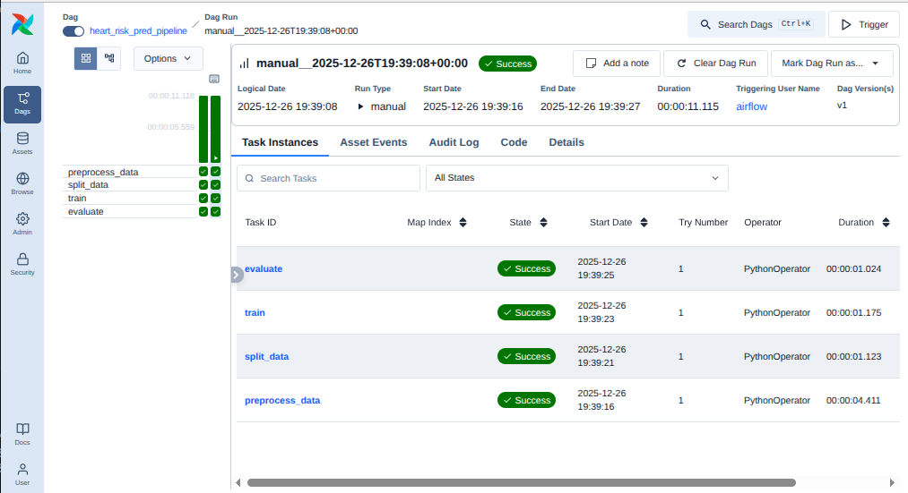

# Getting started with AirFlow

[Just a moment...](https://medium.com/@sudarshan-pant/mlops-with-apache-airflow-part-1-running-airflow-locally-with-docker-c9890adfac32))ocker-c9890adfac32)) in the medium article series.

##### MLOps with Apache Airflow 
- [Part 1: Running Airflow Locally with Docker](https://medium.com/@sudarshan-pant/mlops-with-apache-airflow-part-1-running-airflow-locally-with-docker-c9890adfac32)
- Part 2: ...


---

1. Create a folder and create these directories ```config```, ```dags```, ```logs```, ```plugins```

```bash 
mkdir -p ./dags ./logs ./plugins ./config
echo -e "AIRFLOW_UID=$(id -u)" > .env

```

| Directory  | Purpose                                                                 |
|------------|-------------------------------------------------------------------------|
| `dags/`    | Contains your workflow definitions (DAGs).                              |
| `logs/`    | Stores execution logs generated by Airflow tasks.                       |
| `plugins/` | Holds custom extensions like operators, hooks, sensors, or plugins.     |
| `config/`  | (Optional) For custom configuration files to override Airflow settings. |


2. Then we need docker desktop. (refer docs.docker.com to install)
3. Next, download ```docker-compose.yaml``` file of airflow latest release . For more information read. [Running Airflow in Docker &mdash; Airflow 3.1.5 Documentation](https://airflow.apache.org/docs/apache-airflow/stable/howto/docker-compose/index.html)
4. Run docker compose

``` bash
 docker compose up airflow-init
 ```  

 5. Once again, run 

 ```bash
docker compose up

 ```

 6. Access web ui at localhost:8080


 This way we setup and run airflow locally. Next, lets create an example ML pipeline.

  For this, we work with the cleveland dataset for heart disease dataset from Cleveland Clinic Foundation with 303 samples with 	classes Healthy(~54%) and Risk (46%). This dataset is commonly used for benchmarkin ML algorithm. In this repo, we do not focus on model performance. The goal is to build a ML pipeline for AirFlow.

  7. Lets place our data in data folder. 
  8. In Step 5 we build run from airflow image . Since we need other dependencies based on our project we will create a container for this project. Therefore add a dockerfile to the root of this project with following content and following the instruction in ```docker-compose.yaml``` uncomment the line with build command in that file.

    ```
    # In order to add custom dependencies or upgrade provider distributions you can use your extended image.
    # Comment the image line, place your Dockerfile in the directory where you placed the docker-compose.yaml
    # and uncomment the "build" line below, Then run `docker-compose build` to build the images.
    #image: ${AIRFLOW_IMAGE_NAME:-apache/airflow:3.1.5}
    build: .
    ```


  ```dockerfile
    FROM apache/airflow:3.1.5 
    COPY requirements.txt . 
    RUN pip install --no-cache-dir -r requirements.txt

  ```

  9. map volumes for data in ```docker-compose.yaml```

  ```dockerfile
 
  - ./data:/opt/airflow/data
  
  ```

10. Then create pipeline as shown in ```heart_risk_pred_pipeline.py``` and run


 ```bash
  docker compose up

 ```

